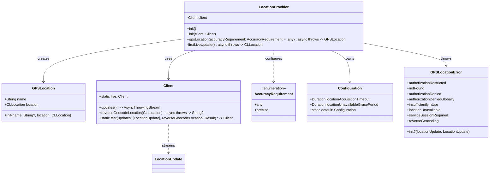
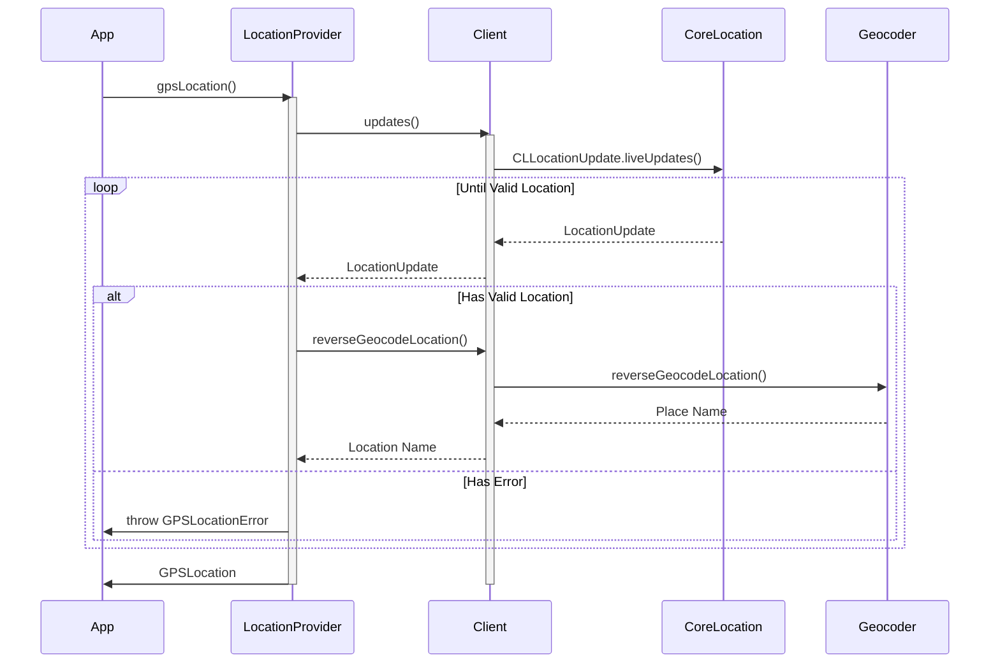
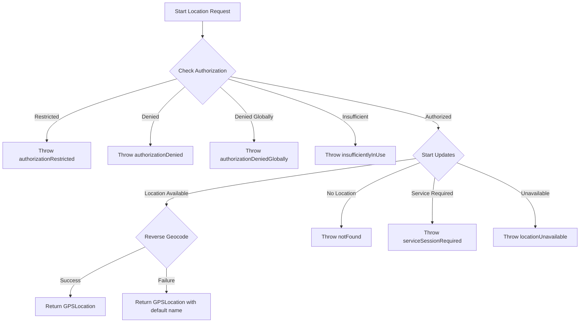

# LocationProvider Technical Documentation

## Architecture Overview

The LocationProvider framework is built with a clean, modular architecture that separates concerns and facilitates testing. Here's a detailed look at how it works.

### Core Components

#### Class Diagram



### Component Responsibilities

1. **LocationProvider**
   - Main entry point for location services
   - Manages location updates and geocoding
   - Handles error states and permission flows
   - Ensures thread safety via @MainActor
   - Exposes `Configuration` to tune acquisition timeout and grace period

2. **GPSLocation**
   - Value type representing a geographical location
   - Combines physical coordinates with human-readable names
   - Provides debug convenience locations
   - Conforms to CustomStringConvertible and Equatable

3. **LocationUpdate Protocol**
   - Defines contract for location updates
   - Encapsulates location state and authorization status
   - Provides rich debugging information
   - Automatically adopted by CLLocationUpdate

4. **Client**
   - Abstracts location service dependencies
   - Enables test doubles and mocking
   - Provides live implementation using CoreLocation
   - Handles reverse geocoding

5. **Configuration**
   - Encapsulates timeout/grace-period tuning knobs
   - Provides sensible defaults for foreground usage

## Sequence Flow

### Location Request Flow



## Control Flow

### Error Handling Flow



## Implementation Details

### Location Updates

The framework uses CoreLocation's modern async/await API to receive location updates. Key points:

1. **Initialization**
   ```swift
   let provider = LocationProvider()
   ```
   - Creates a live client by default
   - Configures for main thread safety
   - Prepares update stream

2. **Update Processing**
   - Filters invalid locations
   - Handles authorization changes
   - Manages error states
   - Provides continuous updates

3. **Reverse Geocoding**
   - Attempts to get human-readable names
   - Gracefully handles failures
   - Provides meaningful defaults

### Error Handling Strategy

The framework uses a comprehensive error handling system:

1. **Authorization Errors**
   - Handled early in the process
   - Provide clear user guidance
   - Support system settings links

2. **Location Errors**
   - Managed during update stream
   - Include temporary failures
   - Support retry mechanisms

3. **Geocoding Errors**
   - Non-fatal by design
   - Fall back to coordinate data
   - Preserve location functionality

### Testing Support

The framework is designed for testability:

1. **Test Client**
   ```swift
   let testClient = LocationProvider.Client.test(
       updates: [mockUpdate],
       reverseGeocodeLocation: .success("Test Location")
   )
   ```

2. **Debug Locations**
   - Predefined locations
   - Common landmarks
   - Tech company headquarters

3. **Mock Updates**
   - Customizable states
   - Error simulation
   - Authorization testing

## Best Practices

1. **Thread Safety**
   - Use @MainActor for UI updates
   - Async operations for long-running tasks
   - Proper error propagation

2. **Memory Management**
   - Value types where possible
   - Proper cleanup of resources
   - Clear ownership semantics

3. **Error Handling**
   - Comprehensive error cases
   - User-friendly messages
   - Recovery suggestions

## Performance Considerations

1. **Battery Usage**
   - Efficient update intervals
   - Proper cleanup of resources
   - Background mode handling

2. **Memory Footprint**
   - Minimal state storage
   - Efficient data structures
   - Resource cleanup

3. **Response Time**
   - Quick initial location
   - Efficient geocoding
   - Fast error detection

## Security Considerations

1. **Privacy**
   - Minimal data collection
   - Clear usage descriptions
   - Proper authorization handling

2. **Data Protection**
   - Secure storage practices
   - Safe error messaging
   - Protected debug information
